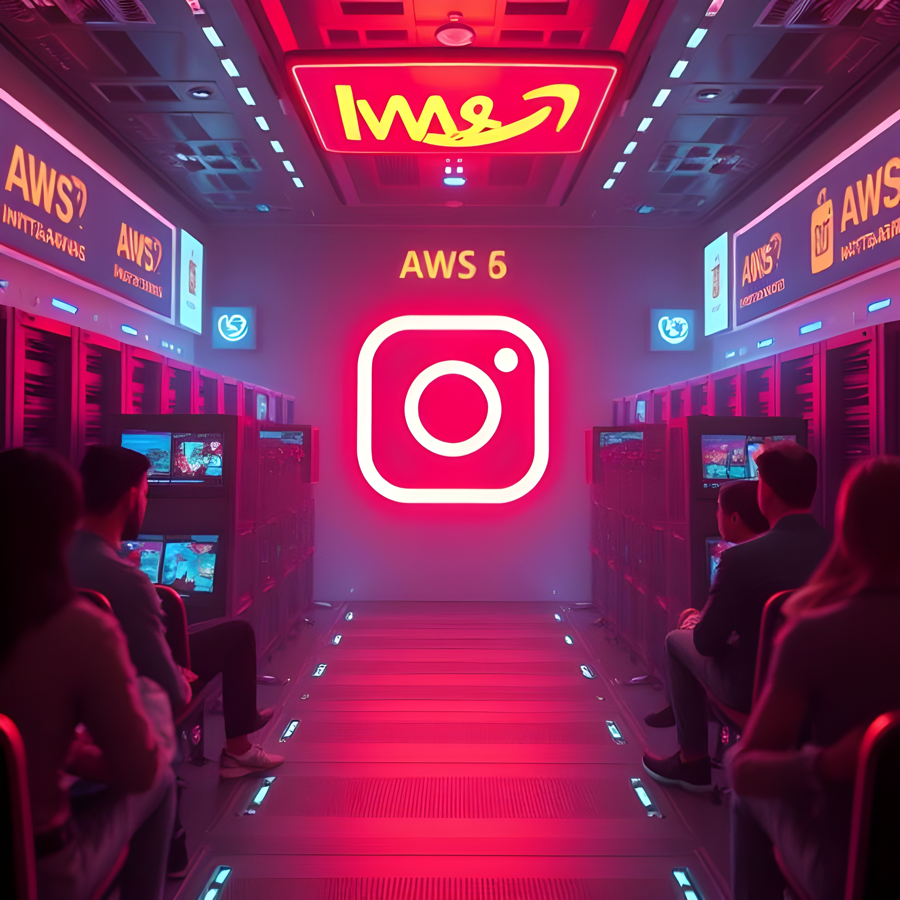

# From Forgotten USB Drives to Cloud Revolution: How Drew Houston's Bus Ride Changed Computing Forever

It's 2007, and Drew Houston is on a bus from Boston to New York. He opens his laptop, ready to work during the long ride, only to realize his USB drive—containing all his work—is sitting at home.

This wasn't the first time Houston had forgotten his files, and his frustration reached a boiling point. "I was so frustrated – really with myself – because this kept happening. I never wanted to have the problem again," Houston later recalled. On that very bus ride, he started writing the code for what would become Dropbox.

But Houston's solution was only possible because of a revolution that had already begun brewing in Seattle, where Amazon had quietly launched something called "S3" just one year earlier.

## The Dark Ages of Computing (Yes, 2006 Was the Dark Ages)

### The Reality of Traditional IT Infrastructure

In the early 2000s, system administrators faced challenges that seem almost unimaginable today. Traditional IT infrastructure was characterized by high capital expenditures, significant maintenance costs, and heavy reliance on physical hardware requiring substantial space, power, and cooling resources.

The typical challenges included:
- **Extended procurement timelines** - Server deployment could take weeks or months
- **High maintenance overhead** - By a server's fifth year, support costs increased by 148%, reaching 300% of initial costs by year seven
- **Poor resource utilization** - Forrester estimated that 80% of IT spending was on maintenance, only 20% on new initiatives
- **Massive upfront investments** - Hardware costs made up 40-50% of total IT expenses
- **Emergency response protocols** - 24/7 monitoring and rapid response were critical

According to IDC estimates from this era, one server typically supported about 200 users, making capacity planning a constant challenge for growing companies.

## The "Aha!" Moment That Changed Everything

By 2003, Amazon faced the same scaling nightmares. During holidays, their servers strained under traffic. The rest of the year? Those expensive machines sat idle.

Jeff Bezos asked a simple question: *"What if we could rent out our excess capacity?"*

But his team went further: *"What if computing could be like electricity—pay for what you use, available instantly?"*

## March 14, 2006: The Day Everything Changed

### Amazon S3 Launch - The First Cloud Storage Service

Amazon launched Simple Storage Service (S3) in March 2006, marking the beginning of the cloud computing revolution. S3 offered three revolutionary promises:
1. **Pay-per-use pricing** - No upfront costs, pay only for storage used
2. **Massive scalability** - Store any amount of data with automatic scaling
3. **Global accessibility** - Access files from anywhere with internet connection

### The First Success Story: SmugMug

SmugMug became one of the very first customers to adopt Amazon S3. In August 2006, just months after S3's launch, SmugMug's CEO Don MacAskill wrote in his blog that they were using "Amazon S3 for a significant part of our storage solution."

The results were dramatic:
- By November 2006, SmugMug reported saving $500K per year
- By April 2007, they had saved almost exactly $1 million
- In 2010, two petabytes of photos were stored on the Amazon S3 service

SmugMug's early adoption validated the S3 service model and demonstrated the significant cost savings possible with cloud storage.

## The Instagram Moment That Proved Everything

### The $1 Billion Validation of Cloud Computing

Fast-forward to April 9, 2012: Facebook acquires Instagram for $1 billion in a combined cash and stock deal. The numbers that shocked Silicon Valley:

**Instagram's Stats at Acquisition:**
- **13 employees** total
- **30 million users** worldwide  
- **Zero revenue** at time of sale
- **Built entirely on AWS** cloud infrastructure

Founded in 2010 by Mike Krieger and Kevin Systrom, Instagram had just closed a $50 million funding round at a $500 million valuation right before the sale.

### The Cloud Infrastructure Advantage

Prior to its acquisition, Instagram was a major AWS user, having built their entire backend on Amazon's cloud services. This allowed a team of just 13 people to manage 30 million users—something that would have required massive infrastructure investments and dozens of IT staff in the pre-cloud era.

After the acquisition, Facebook began a massive migration in April 2013 to move Instagram's backend from AWS to Facebook's data centers, a process that took two years and involved moving over 20 billion photographs.

This acquisition demonstrated the power of cloud infrastructure to enable small teams to achieve massive scale without traditional infrastructure constraints.

## What This Means for You Today

The revolution Drew Houston imagined on that bus? It's complete:

- **2006**: Spinning up a server took 6 weeks
- **2024**: Launch 1,000 servers in 6 seconds

- **Then**: $50,000 upfront for basic infrastructure  
- **Now**: Start with $0, pay $5/month as you grow

- **Before**: Hire a team to manage servers
- **After**: One developer can manage global infrastructure

## The Mindset Shift That Changes Everything

Stop thinking: *"I need a server to run my code"*
Start thinking: *"I just need my code to run"*

It's like owning a car vs. calling an Uber—you get transportation when needed, pay only for the ride, and someone else handles maintenance.

## Your Action Items

1. **Sign up for AWS Free Tier** (seriously, it's free)
2. **Launch your first EC2 instance** (takes 5 minutes)
3. **Deploy a simple app** (prove to yourself how easy it is)

The same infrastructure that powers Netflix, Airbnb, and NASA is available to you right now. What will you build?

---

*Follow me for more AWS insights. Next week: "How Netflix Serves 230 Million Users Without Owning a Single Server"*

**Tags**: #AWS #CloudComputing #TechHistory #Serverless #Innovation #Dropbox #Instagram #TechFounders
